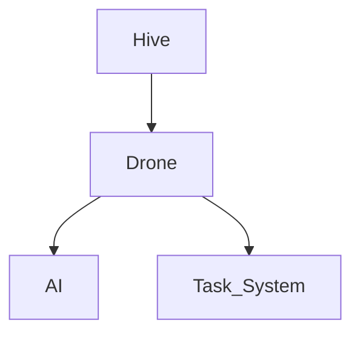
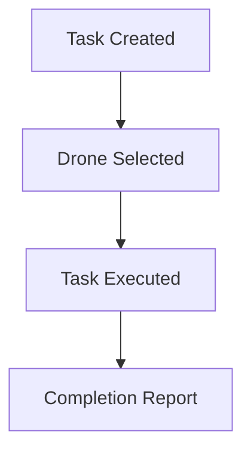
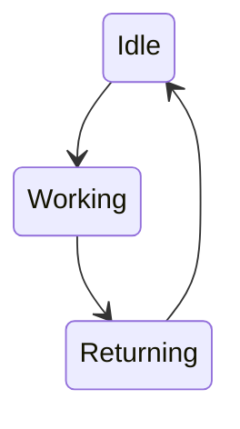
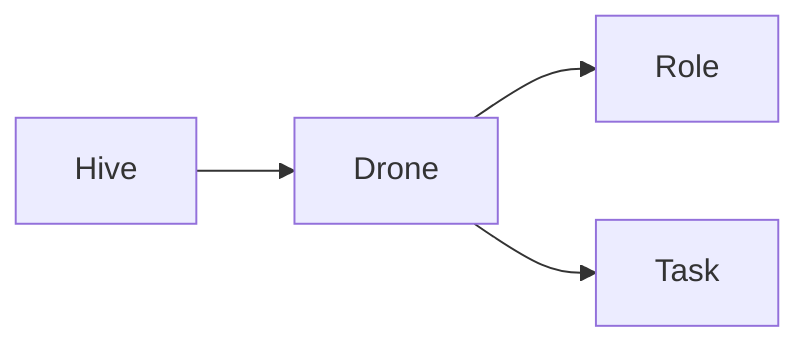

# Living Systems Project — Diagram Standards

**Project:** Living Systems Project
**Document Type:** Development Standard
**Status:** Active
**Version:** 1.0

```yaml
---
title: Diagram Standards
type: Development Standard
status: Active
version: 1.0
module: Living Systems Project
created: YYYY-MM-DD
last_updated: YYYY-MM-DD
---
```

---

# Purpose

This document defines standards for diagrams used throughout the Living Systems Project.

Diagrams should improve understanding of:

* Architecture
* Relationships
* Data flow
* System behavior
* Development processes

---

# Diagram Principles

## Clarity Over Complexity

A diagram should explain a concept, not replace documentation.

If a diagram becomes too complex:

* Split it into smaller diagrams.
* Create separate views.
* Link related diagrams.

---

## One Purpose Per Diagram

Each diagram should answer one primary question.

Examples:

Good:

* "How does a Drone receive tasks?"
* "How does Hive communication work?"

Avoid:

* One diagram showing the entire project.

---

# Preferred Diagram Formats

## Mermaid

Preferred for:

* Architecture diagrams
* Flow diagrams
* State machines
* Relationships

Benefits:

* Stored as text.
* Version control friendly.
* Easy to update.

---

## ASCII Diagrams

Preferred for:

* Simple relationships.
* Folder structures.
* Quick references.

Example:

```text
Hive Core

    |
    |

Drone

    |
    |

Task System
```

---

# Diagram Types

## Architecture Diagram

Shows:

* Major systems.
* Dependencies.
* Communication.

Example:



---

## Flow Diagram

Shows:

* Processes.
* Decision paths.
* Workflows.

Example:



---

## State Diagram

Shows:

* Entity states.
* Transitions.
* Conditions.

Example:



---

## Relationship Diagram

Shows:

* Ownership.
* Associations.
* Dependencies.

Example:



---

# Naming Standards

Use descriptive titles.

Good:

```
Drone Lifecycle State Diagram
```

Avoid:

```
Drone Diagram
```

---

# Diagram Location

Store diagrams near the documentation they support.

Example:

Architecture diagram:

```text
documentation/architecture/
```

Specification diagram:

```text
documentation/specs/
```

---

# Diagram Requirements

Every diagram should include:

* Title
* Purpose
* Legend (if needed)
* Related documentation

Example:

```markdown
## Drone Lifecycle Diagram

Purpose:

Shows the possible states a Drone can enter.

Related:

- SPEC-0001-DRONE_ENTITY.md
- AI_ARCHITECTURE.md
```

---

# Maintenance Rules

Update diagrams when:

* Architecture changes.
* Systems are added or removed.
* Relationships change.
* Specifications are modified.

Outdated diagrams should be marked:

```
Status: Deprecated
```

---

# Review Checklist

Before accepting a diagram:

* [ ] Purpose is clear.
* [ ] Labels are understandable.
* [ ] Relationships are accurate.
* [ ] Diagram matches current architecture.
* [ ] Related documentation is linked.

---

# Document History

| Version | Date       | Changes                   |
| ------- | ---------- | ------------------------- |
| 1.0     | 2026-07-09 | Initial Diagram Standards |
