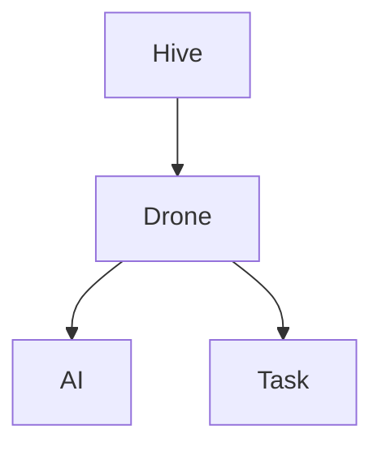

# Living Systems Project — Documentation Style Guide

**Project:** Living Systems Project (LSP)
**Document Type:** Development Standard
**Status:** Active
**Version:** 1.0

---

# Purpose

This document defines the standards used when creating and maintaining documentation within the Living Systems Project.

The goal is to ensure documentation remains:

* Consistent
* Discoverable
* Maintainable
* Understandable
* Useful for both humans and automated tools

Documentation is considered part of the project itself.

---

# Documentation Principles

## 1. Write for Future Understanding

Documentation should answer:

* Why does this exist?
* What problem does it solve?
* How does it work?
* How does it connect to other systems?

Avoid documenting only the final result.

The reasoning behind decisions is equally important.

---

## 2. Prefer Clarity Over Brevity

A short document that creates confusion is worse than a longer document that creates understanding.

Documentation should be concise, but not incomplete.

---

## 3. Avoid Duplicate Sources of Truth

Each concept should have one authoritative location.

Examples:

Architecture decisions belong in:

```
ADR/
```

System design belongs in:

```
01_Architecture/
```

Exact behavior belongs in:

```
02_Specifications/
```

Implementation details belong near the code.

---

# Document Categories

Every document should belong to one category.

---

# Foundation Documents

Location:

```
docs/00_Project/
```

Purpose:

Define:

* Identity
* Vision
* Philosophy
* Principles

These documents should change rarely.

---

# Architecture Documents

Location:

```
docs/01_Architecture/
```

Purpose:

Define:

* System boundaries
* Responsibilities
* Relationships
* Communication patterns

Architecture documents should remain stable over time.

---

# Specification Documents

Location:

```
docs/02_Specifications/
```

Purpose:

Define:

* Required behavior
* Requirements
* Interfaces
* Acceptance criteria

Specifications evolve during development.

---

# Development Documents

Location:

```
docs/03_Development/
```

Purpose:

Define:

* Workflow
* Standards
* Tooling
* Processes

---

# Historical Documents

Location:

```
docs/04_History/
```

Purpose:

Record:

* Decisions
* Changes
* Milestones
* Evolution

Historical documents preserve context.

---

# Roadmap Documents

Location:

```
docs/05_Roadmap/
```

Purpose:

Define:

* Planned work
* Priorities
* Future direction

---

# Reference Documents

Location:

```
docs/06_Reference/
```

Purpose:

Provide:

* Indexes
* Definitions
* Navigation

---

# Required Document Header

Every major document should include metadata.

Example:

```yaml
---
title: Document Title
type: Architecture
status: Active
version: 1.0
owner: Living Systems Project
module: HiveMind
created: YYYY-MM-DD
last_updated: YYYY-MM-DD
---
```

---

# Document Structure Standard

Major documents should generally follow:

```markdown
# Title

Metadata

---

# Purpose

Why this document exists.

---

# Overview

High-level explanation.

---

# Details

Main content.

---

# Relationships

Connections to other systems.

---

# Future Considerations

Possible expansion.

---

# Related Documentation

Links to relevant documents.

---

# Document History

Changes over time.
```

---

# Naming Conventions

## Documents

Use:

```
UPPERCASE_WITH_UNDERSCORES.md
```

Examples:

```
SYSTEM_ARCHITECTURE.md

PROJECT_OVERVIEW.md

AI_ARCHITECTURE.md
```

---

## Specifications

Use:

```
SPEC-####-NAME.md
```

Examples:

```
SPEC-0001-DRONE_ENTITY.md

SPEC-0002-DRONE_LIFECYCLE.md
```

---

## Architecture Decision Records

Use:

```
ADR-####-NAME.md
```

Examples:

```
ADR-0001-PROJECT_ORIGIN.md

ADR-0002-FABRIC_SELECTION.md
```

---

# Linking Standards

Documents should reference related documents.

Example:

```markdown
## Related Documentation

### Architecture

- SYSTEM_ARCHITECTURE.md
- ENTITY_ARCHITECTURE.md

### Specifications

- SPEC-0001-DRONE_ENTITY.md

### History

- ADR-0003-DRONE_RENAMING.md
```

---

# Diagrams

Diagrams should use text-based formats whenever possible.

Preferred:

* Mermaid
* ASCII diagrams

Reason:

* Version control friendly
* Easy to edit
* Accessible
* Searchable

Example:



---

# Code References

When referencing code, include:

* File path
* Class name
* Purpose

Example:

```
modules/HiveMind/src/main/java/

DroneEntity.java

Responsible for the base Drone entity implementation.
```

---

# Status Labels

Documents should use one of these statuses:

| Status     | Meaning               |
| ---------- | --------------------- |
| Draft      | Under discussion      |
| Review     | Awaiting approval     |
| Active     | Current standard      |
| Deprecated | No longer recommended |
| Archived   | Historical reference  |

---

# Review Expectations

Documents should be reviewed when:

* Architecture changes
* Specifications change
* Systems are removed
* Major releases occur

---

# Documentation Quality Checklist

Before completing a document:

* [ ] Purpose is clearly defined
* [ ] Scope is identified
* [ ] Related documents are linked
* [ ] Terminology is consistent
* [ ] Ownership is clear
* [ ] Future considerations are documented
* [ ] History section exists

---

# Core Principle

The Living Systems Project follows:

> Documentation is not a record of development. Documentation is part of development.

---

# Document History

| Version | Date | Changes                           |
| ------- |------| --------------------------------- |
| 1.0     | 2026-07-09 | Initial Documentation Style Guide |
