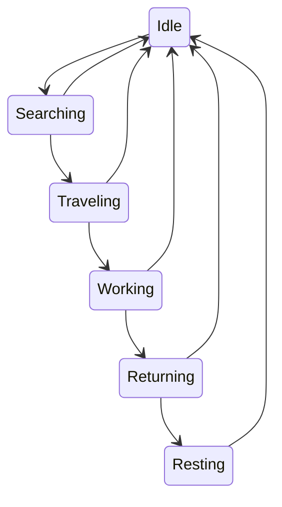

# SPEC-0003 — Drone State Machine

**Project:** Living Systems Project
**Module:** HiveMind
**Document Type:** Specification
**Status:** Draft
**Version:** 1.0

```yaml
---
title: SPEC-0003-DRONE_STATE_MACHINE
type: Specification
status: Draft
version: 1.0
module: HiveMind
created: YYYY-MM-DD
last_updated: YYYY-MM-DD
---
```

---

# Purpose

Define the operational states and transitions used by HiveMind Drones.

The state machine controls:

* Current activity.
* Behavior transitions.
* AI decision flow.
* Debug visibility.

---

# Overview

A Drone state represents its current operational condition.

Example:

A Drone may have:

```text
Lifecycle:
Active

Role:
Worker

State:
Gathering
```

Each system has a different responsibility.

| System    | Purpose                  |
| --------- | ------------------------ |
| Lifecycle | Defines Drone existence  |
| Role      | Defines specialization   |
| State     | Defines current activity |
| Task      | Defines assigned work    |

---

# Core States

Initial Drone states:

```text
Idle

↓

Searching

↓

Traveling

↓

Working

↓

Returning

↓

Resting
```

---

# State Definitions

## Idle

Default state when no task is active.

Responsibilities:

* Wait for instructions.
* Evaluate possible goals.
* Maintain awareness.

Transitions:

```text
Idle → Searching
Idle → Working
```

---

## Searching

Drone evaluates available actions.

Sources:

* Hive instructions.
* Personal goals.
* Nearby opportunities.

Transitions:

```text
Searching → Traveling
Searching → Idle
```

---

## Traveling

Drone is moving toward a destination.

Examples:

* Resource location.
* Hive location.
* Task location.

Transitions:

```text
Traveling → Working
Traveling → Idle
```

---

## Working

Drone is actively performing a task.

Examples:

* Gathering.
* Building.
* Defending.

Transitions:

```text
Working → Returning
Working → Idle
```

---

## Returning

Drone returns after task completion.

Examples:

* Returning resources.
* Reporting completion.
* Returning to Hive.

Transitions:

```text
Returning → Idle
Returning → Resting
```

---

## Resting

Temporary inactive state.

Future purposes:

* Recovery.
* Energy systems.
* Social behavior.

Transitions:

```text
Resting → Idle
```

---

# State Transition Model



---

# Transition Rules

A state transition should occur only when:

* Current conditions are satisfied.
* Required data exists.
* The transition is valid.

Example:

A Drone cannot enter:

```text
Working
```

without:

* A valid task.
* A destination.
* Required tools/resources.

---

# State Ownership

The State Machine owns:

* Current state.
* Valid transitions.
* Transition validation.

The State Machine does not own:

* Task selection.
* Long-term goals.
* Hive strategy.

---

# AI Relationship

The state machine provides the framework for AI behavior.

Example:

```text
AI Goal Selection

↓

Task Assigned

↓

State Transition

↓

Action Execution
```

---

# Debug Information

The state machine should support visible debugging.

Example:

```text
Drone Alpha

State:
Working

Task:
Gather Wood

Target:
Forest

Next:
Returning
```

---

# Future Expansion

Possible future states:

## Combat

```text
Idle
 ↓
Combat Alert
 ↓
Engaging
 ↓
Returning
```

---

## Emergency

Examples:

* Lost Hive connection.
* Threat detected.
* Unable to complete task.

---

## Social

Examples:

* Communicating.
* Assisting another Drone.
* Following Hive signals.

---

# Testing Criteria

* [ ] States initialize correctly.
* [ ] Invalid transitions are blocked.
* [ ] Valid transitions execute.
* [ ] State persists correctly.
* [ ] AI can trigger transitions.
* [ ] Debug information displays accurately.

---

# Related Documentation

## Architecture

* AI_ARCHITECTURE.md
* ENTITY_ARCHITECTURE.md

## Specifications

* SPEC-0001-DRONE_ENTITY.md
* SPEC-0002-DRONE_LIFECYCLE.md
* SPEC-0005-TASK_ASSIGNMENT.md

---

# Implementation Status

| Area           | Status   |
| -------------- | -------- |
| Design         | Complete |
| Specification  | Draft    |
| AI Integration | Planned  |
| Testing        | Pending  |

---

# Document History

| Version | Date       | Changes                                   |
| ------- | ---------- | ----------------------------------------- |
| 1.0     | YYYY-MM-DD | Initial Drone State Machine Specification |

Left off here: Delete after returning 7/9/26